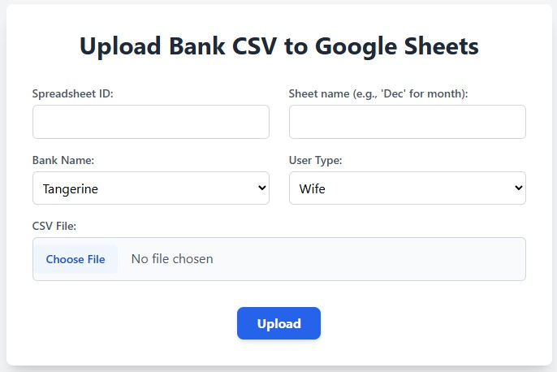
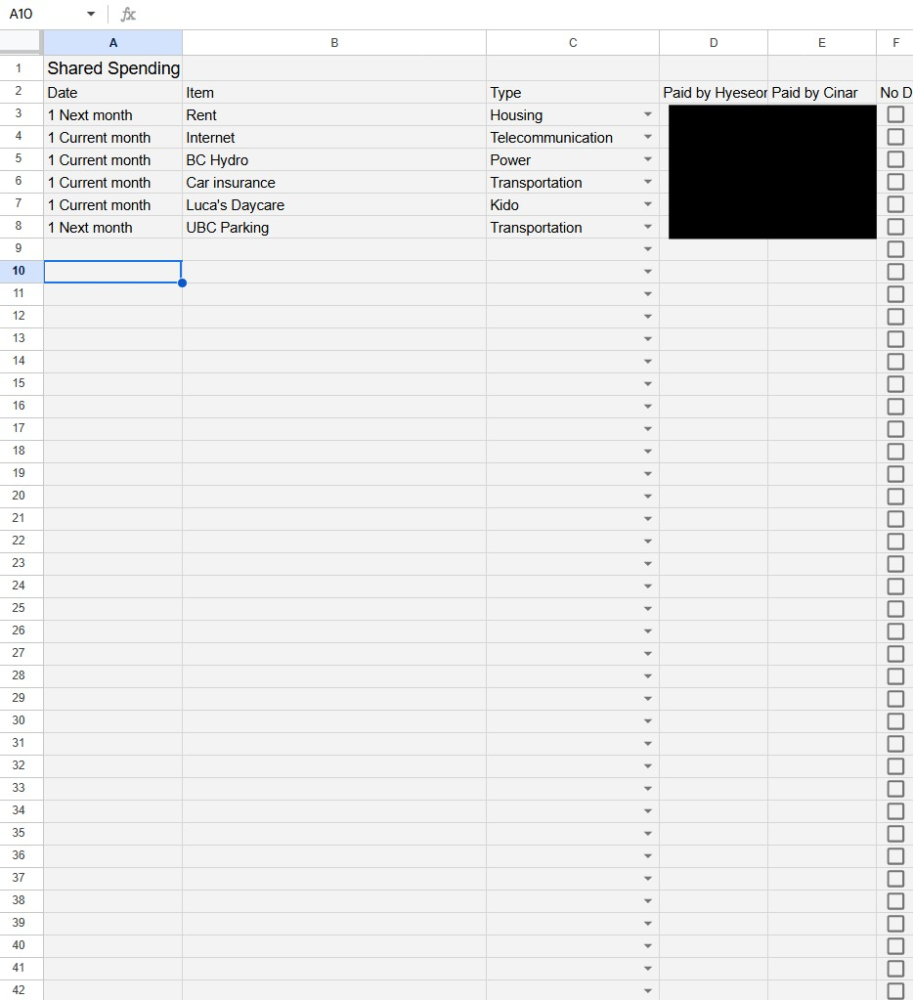
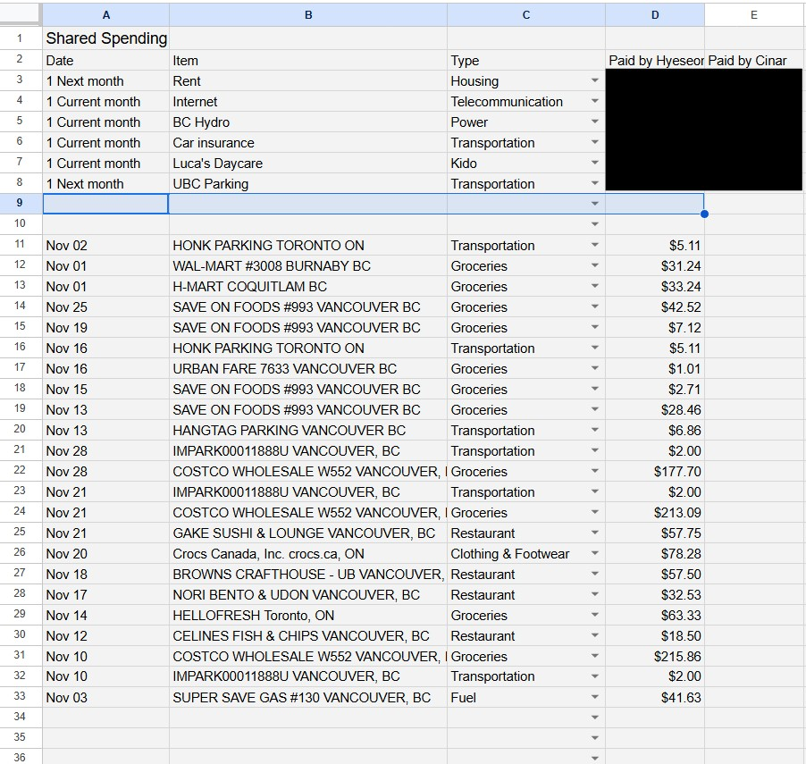

# Bank CSV to Google Sheets Uploader Server

This project is a Python-based web server that processes bank transaction CSV files (from Tangerine or CIBC) uploaded by the user. It applies categorization rules (pre-determined by the spreadsheet) based on keywords in the transaction description and then uploads the processed results to the selected Google Sheet using batch updates to significantly reduce Google Sheets API usage. The data is routed to the appropriate worksheet based on user type (wife or husband) and sheet name (usually month name).

This tool streamlines my household expense tracking by making monthly spending organization fast and reliable.

## 📸 Visual Demonstration

These images show the user interface for file upload and the final result of the automated data processing pipeline.

### 1. Web Upload Interface

This simple Flask web page allows users to input the required spreadsheet parameters and select the local bank CSV file before processing begins.



### 2. Google Sheet (Before Running)

This is a view of the target Google Sheet before the upload process is initiated.



### 3. Google Sheet (After Running)

This view shows the Google Sheet automatically populated with the clean, standardized transaction data after the Python/Flask server has processed the CSV and interacted with the Google Sheets API.




## Setup Instructions

1.  **Prerequisites**:
    *   Python 3.x
    *   Pip (Python package installer)

2.  **Clone the Repository (if you haven't already)**:
    ```bash
    git clone <repository_url>
    cd <repository_directory>
    ```

3.  **Install Dependencies**:
    Create a virtual environment (recommended):
    ```bash
    python3 -m venv venv
    source venv/bin/activate  # On Windows use `venv\Scripts\activate`
    ```
    Install the required packages:
    ```bash
    pip install -r requirements.txt
    ```

4.  **Google Service Account Key**:
    *   This application uses a Google Service Account to interact with your Google Sheets.
    *   You need to obtain a JSON key file for your service account from the Google Cloud Console.
    *   The application is currently configured to look for a key file named `googleSpreadsheetAPIKEY.json` in the root directory of the project.
    *   **IMPORTANT SECURITY NOTE**: The `googleSpreadsheetAPIKEY.json` included in this repository might be a placeholder. **DO NOT use placeholder or publicly exposed keys for sensitive data.** Replace it with your actual service account key file.
    *   Ensure your actual key file is named `googleSpreadsheetAPIKEY.json` and placed in the root directory, OR modify the `keyfile_path` variable in `server.py` to point to your key file's actual name and location.
    *   **NEVER commit your actual private key file to version control.** If you are using Git, add the name of your actual key file to your `.gitignore` file.

## Running the Server

1.  **Start the Flask Server**:
    Once the dependencies are installed and the Google Service Account key is in place, run the server:
    ```bash
    python server.py
    ```
    By default, the server will run on `http://127.0.0.1:5000/`. You should see output indicating the server is running.

## Using the API

The server provides one main endpoint: `/upload`.

*   **Endpoint**: `/upload`
*   **Method**: `POST`
*   **Request Type**: `multipart/form-data`

**Form Fields**:

*   `spreadsheet_id` (text): The ID of the Google Spreadsheet to upload to.
*   `keyword` (text): A keyword to identify the target worksheet (e.g., "Dec" for a worksheet titled "December Expenses").
*   `bankname` (text): The name of the bank. Must be either `tangerine` or `cibc`.
*   `usertype` (text/number): The user type, either `1` or `2`.
*   `csv_file` (file): The CSV file containing the bank transactions.

**Example using `curl`**:

Replace placeholders (`YOUR_SPREADSHEET_ID`, `MONTH_KEYWORD`, `your_bank_name`, `USER_TYPE_NUMBER`, `path/to/your/transactions.csv`) with actual values.

```bash
curl -X POST -F "spreadsheet_id=YOUR_SPREADSHEET_ID"              -F "keyword=MONTH_KEYWORD"              -F "bankname=your_bank_name"              -F "usertype=USER_TYPE_NUMBER"              -F "csv_file=@path/to/your/transactions.csv"              http://127.0.0.1:5000/upload
```

**Successful Response**:
```json
{
  "message": "File uploaded and processed successfully!"
}
```

**Error Response (Example)**:
```json
{
  "message": "Invalid bank name. Must be 'tangerine' or 'cibc'."
}
```

## Logging
The server maintains a log file named `server.log` (when not in debug mode) which records requests, errors, and other important events. This can be useful for troubleshooting.
